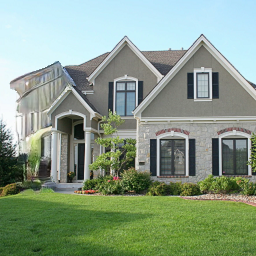

# homework3-GAN-Dissection

## Generate images with GANPaint
> Draw tree

* 可以把樹畫在天空，不像草可以排除天空的可能
> Draw grass in the sky

* 不能把草畫在天空，但被畫的範圍有點綠綠的
> Draw grass

> Draw brick

> Remove dome

> Remove door

＊ 主觀來看，除了generate tree的部分有些情況會有不合理的情況產生，其他generate跟remove的效果都不錯
---
## Dissect any GAN model and analyze what you find
### 1. layer1
#### living room：

#### bed room：

#### Observation：
* 臥室效果比客廳好，可能是因為臥室圈選的物件以床、枕頭以及燈為主，而客廳都是圈選範圍太小，學習效果較差
### 2. layer4
#### living room：

#### bed room：

#### Observation：
* 客廳的圈選範圍還是太小，雖比layer1大，但仍然無法學到途中完整的物件，臥室除了layer1有圈選到的物件以外多了窗戶與衣櫃，辨識的物件更多元
### 3. layer7
#### living room：

#### bed room：

#### Observation：
* 客廳能圈選出圖中較小較細節的物件，臥室圈選的以大物件為主，雖然是layer7但感覺效果不是最好的
---
## Compare with other method
這裡就inpainting的部分，與[Globally and Locally Consistent Image Completion](http://iizuka.cs.tsukuba.ac.jp/projects/completion/en/)(以下簡稱siggraph2017_inpainting)比較。

### Method

如上圖所示，siggraph2017_inpainting這個方法使用了三個networks，其中completion network是用來產生完整的圖片的，global和local discriminator則是幫助訓練。global discriminator能看到整張圖片，幫助達成整個圖片的連貫，local discriminator則只會看到一部份的input圖片，讓局部區域能夠一致。在訓練過程中，除了來自兩個discriminators的GAN loss以外，還加上了和原圖比較的MSE loss，讓model更加穩定。最後，對輸出的圖片有使用簡單的後處理，調整補上部分的顏色符合其四周的顏色。
### Compare

|Input|Mask|gandissect|siggraph2017_inpainting|
|-----------|-----------|-----------|-----------|
|||||
|||||
|||||

可以看到siggraph2017_inpainting在有大範圍缺塊十處裡得非常糟糕，不過填補大範圍且沒有參考基準也是一件莫名其妙的事就是了，當初訓練的目的就不是讓其發揮創造力的，穩定反而是主要考量點，雖然結果看起來也不是很穩定。  
相較之下，gandissect只是在移除自己生成出來的東西，所以能夠大範圍地更換。不過也不容易將重要的內容移除及結構上的改變，可能只是替換成類似的，或是還有殘留。

|Input|Mask|gandissect|siggraph2017_inpainting|
|-----------|-----------|-----------|-----------|
|||||
|||||

上圖為對小範圍進行的測試，比較可知，siggraph2017_inpainting在小範圍的表現上是不差的，而且不會有移除不了的問題。

|Input|Mask|siggraph2017_inpainting|
|-----------|-----------|-----------|
||||

上圖為siggraph2017_inpainting套用在真實影像，而非GAN生成影像的結果。由於siggraph2017_inpainting在training的過程中是使用真實的影像，因此可見在真實影像上的表現好非常多，雖然風格還不是很一致，但穩定很多。有此可見GAN生成出的影像雖然看起來很像真的，但對CNN model來講還是有明顯的差異。  

### Discussion and Conclution

siggraph2017_inpainting在修補GAN生成的影像時，明顯表現得較差，表示兩者有明顯的差別。而其中小範圍修補比大範圍修補表現要好，也呼應當初network的設計，被擾亂的是global的物品辨識與完整的功能，而非local的填補功能。local的填補應該能複製任何形式的local pattern而不被影響。  
在這次比較中可以看到，GAN的影像在生成之後，可能難以套用既有的後處理方法，甚至使用一樣有GAN技術來訓練的mode來做後處理也會有巨大的落差。

